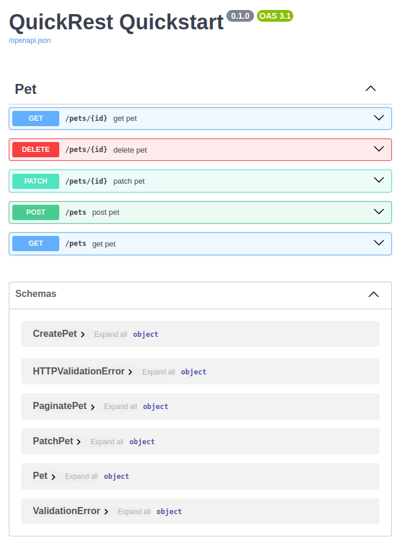

# QuickRest

_You deserve a break._

**QuickRest is a schema-first RESTful API framework for [FastAPI](https://fastapi.tiangolo.com/).**

!!! Warning "QuickRest is still in Development"
    QuickRest is still under development and isn't yet in a stable release. High-level changes may still be made.

[![License][license badge]][license]
![Coverage][coverage badge]

[license badge]: https://img.shields.io/badge/License-MIT-blue.svg
[license]: https://opensource.org/licenses/MIT


[coverage badge]: https://img.shields.io/endpoint?url=https://gist.githubusercontent.com/Lkruitwagen/a16058370777530ed286dab325015195/raw/quickrest_coverage_badge.json

QuickRest provides a series of mixin classes for [SQLAlchemy](https://www.sqlalchemy.org/) declarative mapping table classes that automatically build `create`, `read`, `update`, `delete`, and `search` (CRUD) FastAPI endpoints, as well as the necessary database controllers and [Pydantic](https://docs.pydantic.dev/latest/) models.

QuickRest also allows the developer to specify related objects or properties to be serialized on the given resource, and can automatically extend `read` routes with routes for related objects.

Unique to QuickRest, a developer can also specify fine-grained access-control strategies for tables, by injecting a user-generating (and user-authenticating) function specified by the developer. All endpoint routes are asynchronous.

QuickRest is not an abstraction of FastAPI and/or SQLAlchemy, and non-CRUD business logic can live happily alongside QuickRest routes. QuickRest just automates the production of repetitive CRUD routes and controllers, improving maintainability and saving developer time. Your developers can instead focus on more value-adding work, or, you know, take a break.

=== "Simple Schema-First App"

    ```python
    import uvicorn
    from fastapi import FastAPI
    from sqlalchemy.orm import Mapped, mapped_column

    from quickrest import Base, Resource, RouterFactory


    class Pet(Base, Resource):
        __tablename__ = "pets"
        # note: all Resource classes have an id column by default
        name: Mapped[str] = mapped_column()
        specie: Mapped[str] = mapped_column()


    app = FastAPI(title="QuickRest Quickstart")

    RouterFactory.mount(app, [Pet])

    if __name__ == "__main__":
        uvicorn.run(app, host="0.0.0.0", port=8000)
    ```
=== "OpenAPI Swagger UI with auto-generated CRUD+Search routes"

    

### Resource Mixin

The `Resource` class is the primary mixin the build the CRUD+Search endpoints for the resource.
The Resource can be configured with a `ResourceParams` inner class which must be called `resource_cfg`.
These properties modify the resource accross all CRUD methods.
Resources can also be given a `router_cfg` that subclasses `RouterParams`.
These parameters are provided to FastAPI when building the base router and the individual CRUD routers.
The Resource mixin automatically builds a pydantic `BaseModel` and a `PaginatedBaseModel` which are used by multiple routes.

The default `Resource` class inherits mixins for each of the CRUD method plus a generic search method, each of which add a controller, router, and any necessary input schema.
The CRUD mixins each have their own respect configuration class, which can be defined, respectively, as `read_cfg`, `create_cfg`, `patch_cfg`, `delete_cfg`, and `search_cfg`.
These config classes allow the developer to define (or overwrite) endpoint specific properties like the `tags`, `description`, and `summary`.
They also allow the developer to specify certain properties of the route, like which parameters of the model should be included or excluded.

### Fine-Grained Access Control

QuickRest also provides fine-grained access control mixins for resources.
Two access control patterns are currently supported: a `Private` resource, where only the resource creator has access to objects they've created;
and a `Publishable` resource, where resource creators can optionally share their objects publicly.
To use the fine-grained access control utilities, these classes must be defined at runtime from their respective `make_private` and `make_publishable` methods.
These build methods must also reference the owner Resource model that will own the resources.
This resource must have the `User` mixin.

```python
import uvicorn
from fastapi import FastAPI
from sqlalchemy.orm import Mapped, mapped_column

from quickrest import Base, Resource, RouterFactory, make_private


class Owner(Base, Resource, User):
    __tablename__ = "Owners"
    name: Mapped[str] = mapped_column


class Pet(Base, Resource, make_private(user_model=Owner)):
    __tablename__ = "pets"
    name: Mapped[str] = mapped_column()
    specie: Mapped[str] = mapped_column()
```

### RouterFactory

The `RouterFactory` class is needed to finally rebuild all schemae, reconciling any forward references, and then mount the routes to the main FastAPI app.

```python
from quickrest import RouterFactory

# ... build models, etc.

app = FastAPI
```

## Installation

QuickRest is available via the python package index (PyPi). It can be installed with simply:

    pip install quickrest

## Useage


### Initialization from Environment

When the `Resource` class is first imported, it is initialized from environment variables.


### Manually Building Classes

Each `Resource` has a

## Quickstart Example

## Extensive Example
